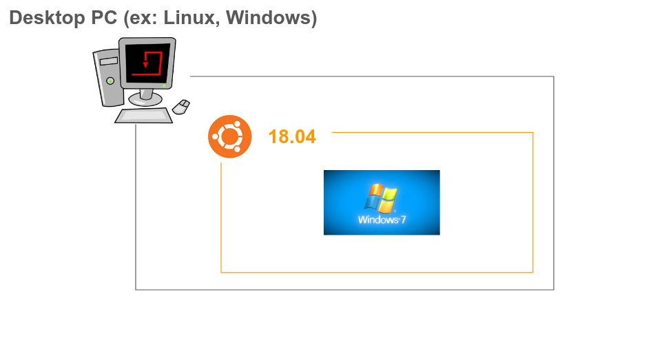

# cuckoo-vagrant

## Environment

## Set-up

> On host

1. `git clone `
1. `vagrant up`

> On cuckoo host

1. `git clone https://github.com/terib0l/cuckoo-vm.git`
1. `sh install.sh`
1. `cuckoo`
1. `cuckoo web`
1. goto localhost:8000

## Memo

- [Setting up Cuckoo Sandbox Step by Step Guide(Malware Analysis Tool)](https://medium.com/@oshara.16/setting-up-cuckoo-sandbox-for-dummies-malware-analysis-3daa99e950b5)
- [Installing the MalConfScan with Cuckoo to Analyze Emotet](https://soji256.medium.com/build-a-malconfscan-with-cuckoo-environment-to-analyze-emotet-ff0c4c589afe)
